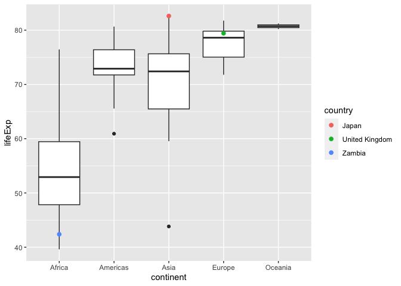

Gapminder
================
Jacqueline Zeng
2020-2-26

- <a href="#grading-rubric" id="toc-grading-rubric">Grading Rubric</a>
  - <a href="#individual" id="toc-individual">Individual</a>
  - <a href="#due-date" id="toc-due-date">Due Date</a>
- <a href="#guided-eda" id="toc-guided-eda">Guided EDA</a>
  - <a
    href="#q0-perform-your-first-checks-on-the-dataset-what-variables-are-in-this"
    id="toc-q0-perform-your-first-checks-on-the-dataset-what-variables-are-in-this"><strong>q0</strong>
    Perform your “first checks” on the dataset. What variables are in
    this</a>
  - <a
    href="#q1-determine-the-most-and-least-recent-years-in-the-gapminder-dataset"
    id="toc-q1-determine-the-most-and-least-recent-years-in-the-gapminder-dataset"><strong>q1</strong>
    Determine the most and least recent years in the <code>gapminder</code>
    dataset.</a>
  - <a
    href="#q2-filter-on-years-matching-year_min-and-make-a-plot-of-the-gdp-per-capita-against-continent-choose-an-appropriate-geom_-to-visualize-the-data-what-observations-can-you-make"
    id="toc-q2-filter-on-years-matching-year_min-and-make-a-plot-of-the-gdp-per-capita-against-continent-choose-an-appropriate-geom_-to-visualize-the-data-what-observations-can-you-make"><strong>q2</strong>
    Filter on years matching <code>year_min</code>, and make a plot of the
    GDP per capita against continent. Choose an appropriate
    <code>geom_</code> to visualize the data. What observations can you
    make?</a>
  - <a
    href="#q3-you-should-have-found-at-least-three-outliers-in-q2-but-possibly-many-more-identify-those-outliers-figure-out-which-countries-they-are"
    id="toc-q3-you-should-have-found-at-least-three-outliers-in-q2-but-possibly-many-more-identify-those-outliers-figure-out-which-countries-they-are"><strong>q3</strong>
    You should have found <em>at least</em> three outliers in q2 (but
    possibly many more!). Identify those outliers (figure out which
    countries they are).</a>
  - <a
    href="#q4-create-a-plot-similar-to-yours-from-q2-studying-both-year_min-and-year_max-find-a-way-to-highlight-the-outliers-from-q3-on-your-plot-in-a-way-that-lets-you-identify-which-country-is-which-compare-the-patterns-between-year_min-and-year_max"
    id="toc-q4-create-a-plot-similar-to-yours-from-q2-studying-both-year_min-and-year_max-find-a-way-to-highlight-the-outliers-from-q3-on-your-plot-in-a-way-that-lets-you-identify-which-country-is-which-compare-the-patterns-between-year_min-and-year_max"><strong>q4</strong>
    Create a plot similar to yours from q2 studying both
    <code>year_min</code> and <code>year_max</code>. Find a way to highlight
    the outliers from q3 on your plot <em>in a way that lets you identify
    which country is which</em>. Compare the patterns between
    <code>year_min</code> and <code>year_max</code>.</a>
- <a href="#your-own-eda" id="toc-your-own-eda">Your Own EDA</a>
  - <a
    href="#q5-create-at-least-three-new-figures-below-with-each-figure-try-to-pose-new-questions-about-the-data"
    id="toc-q5-create-at-least-three-new-figures-below-with-each-figure-try-to-pose-new-questions-about-the-data"><strong>q5</strong>
    Create <em>at least</em> three new figures below. With each figure, try
    to pose new questions about the data.</a>

*Purpose*: Learning to do EDA well takes practice! In this challenge
you’ll further practice EDA by first completing a guided exploration,
then by conducting your own investigation. This challenge will also give
you a chance to use the wide variety of visual tools we’ve been
learning.

<!-- include-rubric -->

# Grading Rubric

<!-- -------------------------------------------------- -->

Unlike exercises, **challenges will be graded**. The following rubrics
define how you will be graded, both on an individual and team basis.

## Individual

<!-- ------------------------- -->

| Category    | Needs Improvement                                                                                                | Satisfactory                                                                                                               |
|-------------|------------------------------------------------------------------------------------------------------------------|----------------------------------------------------------------------------------------------------------------------------|
| Effort      | Some task **q**’s left unattempted                                                                               | All task **q**’s attempted                                                                                                 |
| Observed    | Did not document observations, or observations incorrect                                                         | Documented correct observations based on analysis                                                                          |
| Supported   | Some observations not clearly supported by analysis                                                              | All observations clearly supported by analysis (table, graph, etc.)                                                        |
| Assessed    | Observations include claims not supported by the data, or reflect a level of certainty not warranted by the data | Observations are appropriately qualified by the quality & relevance of the data and (in)conclusiveness of the support      |
| Specified   | Uses the phrase “more data are necessary” without clarification                                                  | Any statement that “more data are necessary” specifies which *specific* data are needed to answer what *specific* question |
| Code Styled | Violations of the [style guide](https://style.tidyverse.org/) hinder readability                                 | Code sufficiently close to the [style guide](https://style.tidyverse.org/)                                                 |

## Due Date

<!-- ------------------------- -->

All the deliverables stated in the rubrics above are due **at midnight**
before the day of the class discussion of the challenge. See the
[Syllabus](https://docs.google.com/document/d/1qeP6DUS8Djq_A0HMllMqsSqX3a9dbcx1/edit?usp=sharing&ouid=110386251748498665069&rtpof=true&sd=true)
for more information.

``` r
library(tidyverse)
```

    ## ── Attaching packages ─────────────────────────────────────── tidyverse 1.3.2 ──
    ## ✔ ggplot2 3.4.0      ✔ purrr   1.0.1 
    ## ✔ tibble  3.1.8      ✔ dplyr   1.0.10
    ## ✔ tidyr   1.2.1      ✔ stringr 1.5.0 
    ## ✔ readr   2.1.3      ✔ forcats 0.5.2 
    ## ── Conflicts ────────────────────────────────────────── tidyverse_conflicts() ──
    ## ✖ dplyr::filter() masks stats::filter()
    ## ✖ dplyr::lag()    masks stats::lag()

``` r
library(gapminder)
```

*Background*: [Gapminder](https://www.gapminder.org/about-gapminder/) is
an independent organization that seeks to educate people about the state
of the world. They seek to counteract the worldview constructed by a
hype-driven media cycle, and promote a “fact-based worldview” by
focusing on data. The dataset we’ll study in this challenge is from
Gapminder.

# Guided EDA

<!-- -------------------------------------------------- -->

First, we’ll go through a round of *guided EDA*. Try to pay attention to
the high-level process we’re going through—after this guided round
you’ll be responsible for doing another cycle of EDA on your own!

### **q0** Perform your “first checks” on the dataset. What variables are in this

dataset?

``` r
## TASK: Do your "first checks" here!
# glimpse(gapminder)
head(gapminder)
```

    ## # A tibble: 6 × 6
    ##   country     continent  year lifeExp      pop gdpPercap
    ##   <fct>       <fct>     <int>   <dbl>    <int>     <dbl>
    ## 1 Afghanistan Asia       1952    28.8  8425333      779.
    ## 2 Afghanistan Asia       1957    30.3  9240934      821.
    ## 3 Afghanistan Asia       1962    32.0 10267083      853.
    ## 4 Afghanistan Asia       1967    34.0 11537966      836.
    ## 5 Afghanistan Asia       1972    36.1 13079460      740.
    ## 6 Afghanistan Asia       1977    38.4 14880372      786.

``` r
# summary(gapminder)
```

**Observations**:

- country, continent, year, lifeExp, pop, gdpPercap

### **q1** Determine the most and least recent years in the `gapminder` dataset.

*Hint*: Use the `pull()` function to get a vector out of a tibble.
(Rather than the `$` notation of base R.)

``` r
## TASK: Find the largest and smallest values of `year` in `gapminder`
year_max <- max(pull(gapminder, year))
year_min <- min(pull(gapminder, year))

print(year_max)
```

    ## [1] 2007

``` r
print(year_min)
```

    ## [1] 1952

Use the following test to check your work.

``` r
## NOTE: No need to change this
assertthat::assert_that(year_max %% 7 == 5)
```

    ## [1] TRUE

``` r
assertthat::assert_that(year_max %% 3 == 0)
```

    ## [1] TRUE

``` r
assertthat::assert_that(year_min %% 7 == 6)
```

    ## [1] TRUE

``` r
assertthat::assert_that(year_min %% 3 == 2)
```

    ## [1] TRUE

``` r
if (is_tibble(year_max)) {
  print("year_max is a tibble; try using `pull()` to get a vector")
  assertthat::assert_that(False)
}

print("Nice!")
```

    ## [1] "Nice!"

### **q2** Filter on years matching `year_min`, and make a plot of the GDP per capita against continent. Choose an appropriate `geom_` to visualize the data. What observations can you make?

You may encounter difficulties in visualizing these data; if so document
your challenges and attempt to produce the most informative visual you
can.

``` r
## TASK: Create a visual of gdpPercap vs continent

# Attempt 1: I tried making a boxplot but the outliers are too big and prevent the graph from being readable
df_q2 <- gapminder %>% 
  filter(year == year_min) %>% 
  group_by(continent)

df_q2 %>%
  ggplot(aes(x = continent, y = gdpPercap)) +
  geom_boxplot() +
  labs(title = "Continent vs GDP per Capital for 1952", x = "Continent", y = "GDP per Capita")
```

<!-- -->

``` r
# Attempt 2: Remove the outliers and replot the boxplot

# Find outliers
out <- boxplot.stats(df_q2$gdpPercap)$out
out_ind <- which(df_q2$gdpPercap %in% c(out))
print(df_q2[out_ind, ])
```

    ## # A tibble: 11 × 6
    ## # Groups:   continent [4]
    ##    country        continent  year lifeExp       pop gdpPercap
    ##    <fct>          <fct>     <int>   <dbl>     <int>     <dbl>
    ##  1 Australia      Oceania    1952    69.1   8691212    10040.
    ##  2 Bahrain        Asia       1952    50.9    120447     9867.
    ##  3 Canada         Americas   1952    68.8  14785584    11367.
    ##  4 Denmark        Europe     1952    70.8   4334000     9692.
    ##  5 Kuwait         Asia       1952    55.6    160000   108382.
    ##  6 Netherlands    Europe     1952    72.1  10381988     8942.
    ##  7 New Zealand    Oceania    1952    69.4   1994794    10557.
    ##  8 Norway         Europe     1952    72.7   3327728    10095.
    ##  9 Switzerland    Europe     1952    69.6   4815000    14734.
    ## 10 United Kingdom Europe     1952    69.2  50430000     9980.
    ## 11 United States  Americas   1952    68.4 157553000    13990.

``` r
# Create dataset with outliers removed
df_q2_without_outliers <- df_q2[-c(out_ind), ] 

# Boxplot without outliers
df_q2_without_outliers %>% 
  ggplot(aes(x = continent, y = gdpPercap)) +
  geom_boxplot() +
  labs(title = "Continent vs GDP per Capita for 1952 (outliers removed)", x = "Continent", y = "GDP per Capita")
```

<!-- -->

**Observations**:

- Europe has the widest spread of GDP per capita of the 4 continents for
  the year 1952
- Oceania’s continent category was removed after filtering out outliers
- Africa and Asia have similar GDP medians, but Asia’s upper quartiles
  are higher. America’s median GDP is higher than Africa and Asia but
  less than Europe’s

**Difficulties & Approaches**:

- I first filtered the dataset to match the min_year value and grouped
  the countries by continents. I then plotted a boxplot based on this
  data. The resulting boxplot (first output in the above code section)
  was difficult to understand as the outliers were extremely high and
  squashed the boxplots into a thin sliver at the bottom of the plot.
  This was not very readable.
- I addressed this by identifying the outliers, removing them from the
  dataset, and replotting a boxplot.

### **q3** You should have found *at least* three outliers in q2 (but possibly many more!). Identify those outliers (figure out which countries they are).

``` r
## TASK: Identify the outliers from q2
out <- boxplot.stats(df_q2$gdpPercap)$out
out_ind <- which(df_q2$gdpPercap %in% c(out))
print(df_q2[out_ind, ])
```

    ## # A tibble: 11 × 6
    ## # Groups:   continent [4]
    ##    country        continent  year lifeExp       pop gdpPercap
    ##    <fct>          <fct>     <int>   <dbl>     <int>     <dbl>
    ##  1 Australia      Oceania    1952    69.1   8691212    10040.
    ##  2 Bahrain        Asia       1952    50.9    120447     9867.
    ##  3 Canada         Americas   1952    68.8  14785584    11367.
    ##  4 Denmark        Europe     1952    70.8   4334000     9692.
    ##  5 Kuwait         Asia       1952    55.6    160000   108382.
    ##  6 Netherlands    Europe     1952    72.1  10381988     8942.
    ##  7 New Zealand    Oceania    1952    69.4   1994794    10557.
    ##  8 Norway         Europe     1952    72.7   3327728    10095.
    ##  9 Switzerland    Europe     1952    69.6   4815000    14734.
    ## 10 United Kingdom Europe     1952    69.2  50430000     9980.
    ## 11 United States  Americas   1952    68.4 157553000    13990.

**Observations**:

- Identify the outlier countries from q2
  - Australia, Bahrain, Canada, Denmark, Kuwait, Netherlands, New
    Zealand, Norway, Switzerland, United Kingdom

*Hint*: For the next task, it’s helpful to know a ggplot trick we’ll
learn in an upcoming exercise: You can use the `data` argument inside
any `geom_*` to modify the data that will be plotted *by that geom
only*. For instance, you can use this trick to filter a set of points to
label:

``` r
## NOTE: No need to edit, use ideas from this in q4 below
gapminder %>%
  filter(year == max(year)) %>%

  ggplot(aes(continent, lifeExp)) +
  geom_boxplot() +
  geom_point(
    data = . %>% filter(country %in% c("United Kingdom", "Japan", "Zambia")),
    mapping = aes(color = country),
    size = 2
  )
```

<!-- -->

### **q4** Create a plot similar to yours from q2 studying both `year_min` and `year_max`. Find a way to highlight the outliers from q3 on your plot *in a way that lets you identify which country is which*. Compare the patterns between `year_min` and `year_max`.

*Hint*: We’ve learned a lot of different ways to show multiple
variables; think about using different aesthetics or facets.

``` r
## TASK: Create a visual of gdpPercap vs continent
df_q4 <- gapminder %>% 
  filter(year == c(year_min,year_max)) %>% 
  group_by(continent)

# Get outliers
out <- boxplot.stats(df_q4$gdpPercap)$out
out_ind <- which(df_q4$gdpPercap %in% c(out))
print(df_q4[out_ind, ])
```

    ## # A tibble: 33 × 6
    ## # Groups:   continent [4]
    ##    country        continent  year lifeExp      pop gdpPercap
    ##    <fct>          <fct>     <int>   <dbl>    <int>     <dbl>
    ##  1 Australia      Oceania    2007    81.2 20434176    34435.
    ##  2 Austria        Europe     2007    79.8  8199783    36126.
    ##  3 Bahrain        Asia       2007    75.6   708573    29796.
    ##  4 Belgium        Europe     2007    79.4 10392226    33693.
    ##  5 Canada         Americas   2007    80.7 33390141    36319.
    ##  6 Czech Republic Europe     2007    76.5 10228744    22833.
    ##  7 Denmark        Europe     2007    78.3  5468120    35278.
    ##  8 Finland        Europe     2007    79.3  5238460    33207.
    ##  9 France         Europe     2007    80.7 61083916    30470.
    ## 10 Germany        Europe     2007    79.4 82400996    32170.
    ## # … with 23 more rows

``` r
# Plot both graphs on same plot
df_q4 %>%
  ggplot(aes(x = continent, y = gdpPercap)) +
  geom_boxplot() +
  labs(title = "Continent vs GDP per Capita for 1952", x = "Continent", y = "GDP per Capita") + facet_grid(cols = vars(year)) +
  geom_point(
    data = . %>% filter(country %in% c("Australia", "Bahrain", "Canada", "Denmark", "Kuwait", "Netherlands", "New Zealand", "Norway", "Switzerland", "United Kingdom")),
    mapping = aes(color = country),
    size = 2
  )
```

<!-- -->

``` r
df_q4
```

    ## # A tibble: 284 × 6
    ## # Groups:   continent [5]
    ##    country     continent  year lifeExp      pop gdpPercap
    ##    <fct>       <fct>     <int>   <dbl>    <int>     <dbl>
    ##  1 Afghanistan Asia       1952    28.8  8425333      779.
    ##  2 Afghanistan Asia       2007    43.8 31889923      975.
    ##  3 Albania     Europe     1952    55.2  1282697     1601.
    ##  4 Albania     Europe     2007    76.4  3600523     5937.
    ##  5 Algeria     Africa     1952    43.1  9279525     2449.
    ##  6 Algeria     Africa     2007    72.3 33333216     6223.
    ##  7 Angola      Africa     1952    30.0  4232095     3521.
    ##  8 Angola      Africa     2007    42.7 12420476     4797.
    ##  9 Argentina   Americas   1952    62.5 17876956     5911.
    ## 10 Argentina   Americas   2007    75.3 40301927    12779.
    ## # … with 274 more rows

**Observations**:

- Africa’s median GDP is around the same for 1952 and 2007, but the it’s
  outliers are higher
- Asia, Europe, America, and Oceania all experienced some degree of
  median GDP rises and widening of the range of GDPs.
- The upper outliers for 2007 are on average more extreme

# Your Own EDA

<!-- -------------------------------------------------- -->

Now it’s your turn! We just went through guided EDA considering the GDP
per capita at two time points. You can continue looking at outliers,
consider different years, repeat the exercise with `lifeExp`, consider
the relationship between variables, or something else entirely.

### **q5** Create *at least* three new figures below. With each figure, try to pose new questions about the data.

``` r
## TASK: Your first graph
# GOAL: What is the life expectancy trend from the first year recorded to the latest year recorded?

# Get outliers
out <- boxplot.stats(df_q4$lifeExp)$out
out_ind <- which(df_q4$lifeExp %in% c(out))
print(df_q4[out_ind, ])
```

    ## # A tibble: 0 × 6
    ## # Groups:   continent [0]
    ## # … with 6 variables: country <fct>, continent <fct>, year <int>,
    ## #   lifeExp <dbl>, pop <int>, gdpPercap <dbl>

``` r
# Plot both graphs on same plot
df_q4 %>%
  ggplot(aes(x = continent, y = lifeExp)) +
  geom_boxplot() +
  labs(title = "Life Expectancy by Continent", x = "Continent", y = "Life Expectancy (Years)") + facet_grid(cols = vars(year))
```

<!-- -->

- The median life expectancy for all continents rose throughout the
  years
- Asia’s rise in life expectancy is the biggest - the median rose from
  around 45 years to 73 years old
- Africa’s whiskers grew longer while all the other continent’s whiskers
  shrunk

``` r
## TASK: Your second graph
# GOAL: Trend with the population
# Get outliers
out <- boxplot.stats(df_q4$pop)$out
```

    ## Warning in x[floor(d)] + x[ceiling(d)]: NAs produced by integer overflow

``` r
out_ind <- which(df_q4$pop %in% c(out))
print(df_q4[out_ind, ])
```

    ## # A tibble: 33 × 6
    ## # Groups:   continent [4]
    ##    country          continent  year lifeExp        pop gdpPercap
    ##    <fct>            <fct>     <int>   <dbl>      <int>     <dbl>
    ##  1 Bangladesh       Asia       2007    64.1  150448339     1391.
    ##  2 Brazil           Americas   1952    50.9   56602560     2109.
    ##  3 Brazil           Americas   2007    72.4  190010647     9066.
    ##  4 China            Asia       1952    44    556263527      400.
    ##  5 China            Asia       2007    73.0 1318683096     4959.
    ##  6 Congo, Dem. Rep. Africa     2007    46.5   64606759      278.
    ##  7 Egypt            Africa     2007    71.3   80264543     5581.
    ##  8 Ethiopia         Africa     2007    52.9   76511887      691.
    ##  9 France           Europe     2007    80.7   61083916    30470.
    ## 10 Germany          Europe     1952    67.5   69145952     7144.
    ## # … with 23 more rows

``` r
# Plot both graphs on same plot
df_q4 %>%
  ggplot(aes(x = continent, y = pop)) +
  geom_boxplot() +
  labs(title = "Population by Continent", x = "Continent", y = "Population") + facet_grid(cols = vars(year))
```

<!-- -->

- Asia has the biggest outliers in terms of population
- Asian has the biggest spread of population
- Europe and Oceania didn’t have significant changes
- Africa and America’s spread and outliers did not change was
  significantly as Asia, but the outliers got bigger, and the spread
  also increased.

``` r
## TASK: Your third graph
# GOAL: deep dive into Asia's population

df_asia <- df_q4 %>% 
  filter(continent == "Asia")

# Get outliers
out <- boxplot.stats(df_asia$pop)$out
```

    ## Warning in x[floor(d)] + x[ceiling(d)]: NAs produced by integer overflow

``` r
out_ind <- which(df_asia$pop %in% c(out))
print(df_asia[out_ind, ])
```

    ## # A tibble: 8 × 6
    ## # Groups:   continent [1]
    ##   country    continent  year lifeExp        pop gdpPercap
    ##   <fct>      <fct>     <int>   <dbl>      <int>     <dbl>
    ## 1 Bangladesh Asia       2007    64.1  150448339     1391.
    ## 2 China      Asia       1952    44    556263527      400.
    ## 3 China      Asia       2007    73.0 1318683096     4959.
    ## 4 India      Asia       1952    37.4  372000000      547.
    ## 5 India      Asia       2007    64.7 1110396331     2452.
    ## 6 Indonesia  Asia       2007    70.6  223547000     3541.
    ## 7 Japan      Asia       2007    82.6  127467972    31656.
    ## 8 Pakistan   Asia       2007    65.5  169270617     2606.

``` r
df_asia %>%
  ggplot(aes(x = continent, y = pop)) +
  geom_boxplot() +
  labs(title = "Asia Population", x = "Year", y = "Population") + facet_grid(cols = vars(year)) +
  geom_point(
    data = . %>% filter(country %in% c("Bangladesh", "China", "India", "Indonesia", "Japan", "Pakistan")),
    mapping = aes(color = country),
    size = 2
  )
```

<!-- -->

- In a deeper dive into Asia’s population trend from the first year to
  the last year of the dataset
- China is the most populous, with India behind it. These are the two
  biggest outliers
